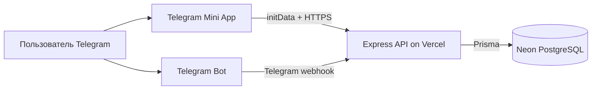

<div align="center">

# FinanceTrackerBot

**Telegram Mini App для учета личных доходов и расходов**

[Открыть Mini App](https://financetrackerapp07.web.app) ·
[Открыть бота](https://t.me/financeOneTrackerBot) ·
[Проверить API](https://finance-tracker-api-two.vercel.app/api/health)

</div>

## О проекте

FinanceTrackerBot объединяет Telegram-бота, Mini App и HTTP API. Пользователь может добавить доход или расход через бота либо через интерфейс приложения. Все данные хранятся в PostgreSQL и привязаны к Telegram-аккаунту пользователя.

Проект уже развернут в production:

| Часть | Сервис | Адрес |
| --- | --- | --- |
| Mini App | Firebase Hosting | [financetrackerapp07.web.app](https://financetrackerapp07.web.app) |
| Telegram-бот | Telegram | [@financeOneTrackerBot](https://t.me/financeOneTrackerBot) |
| Backend API | Vercel Functions | [finance-tracker-api-two.vercel.app](https://finance-tracker-api-two.vercel.app/api/health) |
| База данных | Neon PostgreSQL | Проект `finance-tracker-db`, БД `neondb` |

## Архитектура



Mini App не хранит пароль и не использует JWT. Telegram передает приложению подписанную строку `initData`. Frontend отправляет ее в заголовке `Authorization`, а backend проверяет подпись с помощью токена бота и определяет пользователя.

## Что реализовано

- добавление доходов и расходов через Mini App;
- добавление транзакций через команды бота `/income` и `/expense`;
- главная страница с балансом, последними операциями и расходами по категориям;
- получение транзакций пользователя с пагинацией;
- общие категории доходов и расходов;
- автоматическое создание или обновление пользователя из Telegram `initData`;
- хранение состояния диалогов бота в PostgreSQL;
- production middleware: Helmet, строгий CORS, rate limit и ограничение JSON;
- Telegram webhook, защищенный secret token;
- health check API и отдельная проверка подключения к БД;
- миграции, seed категорий и автоматические тесты.

Страницы истории, аналитики, полезных материалов и настроек пока являются заготовками. API пагинации уже готов, но полноценная страница истории еще не подключена.

## Технологии

### Backend

- Node.js 24, TypeScript, Express 5;
- grammY и `@grammyjs/conversations`;
- Prisma 7 и PostgreSQL;
- Vercel Functions;
- Helmet, CORS и `express-rate-limit`.

### Frontend

- React 19, TypeScript, Vite 8;
- Tailwind CSS и shadcn/ui;
- TanStack Query и Axios;
- React Hook Form и Zod;
- Firebase Hosting.

## API

Все пользовательские методы требуют заголовок:

```http
Authorization: tma <Telegram-WebApp-initData>
```

| Метод | Путь | Назначение |
| --- | --- | --- |
| `GET` | `/api/health` | Проверяет, что сервер запущен |
| `GET` | `/api/ready` | Проверяет сервер и соединение с БД |
| `POST` | `/api/telegram/webhook` | Принимает обновления Telegram |
| `GET` | `/api/categories?type=EXPENSE` | Возвращает категории доходов или расходов |
| `GET` | `/api/dashboard` | Возвращает данные главной страницы |
| `POST` | `/api/transactions` | Создает транзакцию пользователя |
| `GET` | `/api/transactions?page=1&limit=20` | Возвращает транзакции с пагинацией |

Пример тела запроса на создание транзакции:

```json
{
  "categoryId": "uuid-категории",
  "amount": 1250.50,
  "description": "Продукты"
}
```

Ограничения: сумма должна быть положительной, содержать не более двух знаков после запятой и не превышать `9999999999.99`; описание может содержать до 500 символов; `limit` пагинации не может превышать 50.

## Структура репозитория

```text
tg finance-tracker/
├── tgbot/                    # API и Telegram-бот
│   ├── api/                  # entrypoint Vercel Function
│   ├── prisma/               # схема, миграции и seed
│   ├── scripts/              # настройка Telegram webhook
│   └── src/
│       ├── api/              # routes, middleware, auth, validation
│       ├── bot/              # команды и диалоги бота
│       ├── config/           # проверка переменных окружения
│       ├── services/         # бизнес-логика
│       └── app.ts            # сборка Express-приложения
├── tgapp/                    # React Telegram Mini App
│   └── src/
│       ├── api/              # Axios-клиент и API-функции
│       ├── components/       # интерфейс главной страницы
│       ├── layouts/          # навигация приложения
│       └── pages/            # страницы Mini App
├── README.md
└── OBSIDIAN_PROJECT_GUIDE.txt
```

## База данных

Основные таблицы:

| Таблица | Назначение |
| --- | --- |
| `user` | Telegram-пользователи и выбранная валюта |
| `category` | Глобальные и пользовательские категории |
| `transaction` | Доходы и расходы пользователей |
| `bot_conversation` | Текущее состояние диалога с ботом |
| `_prisma_migrations` | История примененных миграций Prisma |

Связи и ограничения описаны в `tgbot/prisma/schema.prisma`. Изменять production-схему вручную не следует: для этого создаются и применяются Prisma-миграции.

## Локальный запуск

### Требования

- Node.js 24;
- npm;
- PostgreSQL;
- Telegram-бот, созданный через BotFather.

### Backend

1. Создайте `tgbot/.env` по примеру `tgbot/.env.example`.
2. Для локальной разработки используйте `TELEGRAM_UPDATE_MODE=polling`.
3. Установите зависимости, примените миграции и добавьте глобальные категории.

```bash
cd tgbot
npm install
npm run db:deploy
npm run db:seed
npm run dev
```

API будет доступен по адресу `http://127.0.0.1:3000/api`.

### Frontend

```bash
cd tgapp
npm install
npm run dev
```

По умолчанию локальный frontend обращается к `http://127.0.0.1:3000/api`. Обычная вкладка браузера не получает Telegram `initData`, поэтому защищенные запросы полноценно работают внутри Telegram Mini App. Для ручной локальной отладки можно временно указать валидное `VITE_DEV_TELEGRAM_INIT_DATA` в локальном `.env`, но его нельзя коммитить.

## Переменные окружения

Полный шаблон находится в `tgbot/.env.example`.

| Переменная | Назначение |
| --- | --- |
| `BOT_TOKEN` | Токен Telegram-бота от BotFather |
| `DATABASE_URL` | Строка подключения PostgreSQL |
| `PROCESS_ROLE` | `all`, `api` или `bot` |
| `TELEGRAM_UPDATE_MODE` | `polling` локально, `webhook` в production |
| `TELEGRAM_WEBHOOK_SECRET` | Проверка подлинности Telegram webhook |
| `TELEGRAM_WEBHOOK_URL` | Полный production URL webhook |
| `TELEGRAM_MINI_APP_URL` | Публичный URL Mini App |
| `CORS_ORIGINS` | Разрешенные frontend-origin через запятую |
| `TELEGRAM_INIT_DATA_MAX_AGE_SECONDS` | Максимальный возраст `initData` |
| `RATE_LIMIT_WINDOW_MS` | Окно rate limit в миллисекундах |
| `RATE_LIMIT_MAX_REQUESTS` | Максимум запросов за окно |
| `TRUST_PROXY` | Доверие proxy-заголовкам в production |

Frontend использует публичную переменную `VITE_API_URL`. Секреты `BOT_TOKEN`, `DATABASE_URL`, `TELEGRAM_WEBHOOK_SECRET` и пользовательский `initData` никогда не должны попадать в Git, README, сообщения или frontend-переменные с префиксом `VITE_`.

## Проверки

```bash
cd tgbot
npm run build
npm test

cd ../tgapp
npm run build
npm run lint
npm test
```

Backend-тесты проверяют Telegram-аутентификацию и валидацию транзакций. Frontend-тесты проверяют форматирование данных. Перед production-деплоем необходимо запускать весь набор команд.

## Production-деплой

### Backend и база

```bash
cd tgbot
npx vercel env run --environment production -- npm run db:deploy
npx vercel deploy --prod
```

После деплоя проверьте:

```text
https://finance-tracker-api-two.vercel.app/api/health
https://finance-tracker-api-two.vercel.app/api/ready
```

Оба адреса должны вернуть `{"ok":true}`.

### Frontend

```bash
cd tgapp
npm run build
npx firebase-tools deploy --only hosting --project financetrackerapp07
```

## Как посмотреть данные

Самый безопасный способ — открыть проект `finance-tracker-db` в [Neon Console](https://console.neon.tech), выбрать базу `neondb` и использовать SQL Editor.

Для просмотра через Prisma Studio:

```bash
cd tgbot
npx vercel env run --environment production -- npx prisma studio
```

После запуска откройте `http://localhost:5555`. Prisma Studio подключится к production-базе, поэтому изменять и удалять строки нужно только при полном понимании последствий.

## Безопасность

- backend доверяет пользователю только после проверки подписи Telegram `initData`;
- каждый запрос получает пользователя из проверенного Telegram ID, а не из тела запроса;
- пользователь не может записать транзакцию в чужую категорию;
- CORS разрешает только настроенные frontend-домены;
- webhook Telegram защищен отдельным secret token;
- диалоги бота хранятся в БД и не теряются при перезапуске serverless-функции;
- сервер скрывает технические детали ошибок от клиента.

Подробная инструкция по поддержке, диагностике, просмотру БД, ротации секретов и восстановлению находится в `OBSIDIAN_PROJECT_GUIDE.txt`.

## Ближайшие задачи

- подключить страницу истории к `GET /api/transactions`;
- добавить фильтры по периоду, типу и категории;
- реализовать аналитику и графики;
- добавить пользовательские категории и настройки валюты;
- расширить интеграционные и UI-тесты;
- оптимизировать размер frontend bundle.
